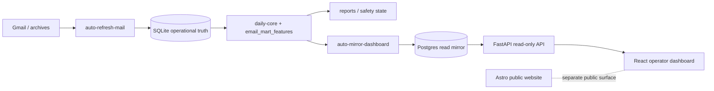

# OrigenLab

<p align="center">
  <strong>Commercial-operations monorepo</strong> for OrigenLab — public website, email intelligence pipeline, read-only operator API, and dashboard.
</p>

<p align="center">
  <a href="https://github.com/rafaelRojasVi/origenlab/actions/workflows/email-pipeline.yml"></a>
  <a href="https://github.com/rafaelRojasVi/origenlab/actions/workflows/api.yml"></a>
  <a href="https://github.com/rafaelRojasVi/origenlab/actions/workflows/dashboard.yml"></a>
  <a href="https://github.com/rafaelRojasVi/origenlab/actions/workflows/web.yml"></a>
  <a href="https://github.com/rafaelRojasVi/origenlab/actions/workflows/secret-scan.yml"></a>
  
  
</p>

---

## What this is

OrigenLab is **not just a website repository**. It is a **commercial-operations monorepo** that combines a public marketing site with operator tooling for commercial intelligence, outbound safety, and read-only operational visibility.

Gmail and archive signals are ingested into **SQLite operational truth** on the operator machine. A feature-backed email mart supports fast `daily-core` rebuilds. **Postgres** is a read-only dashboard/reporting mirror — not send/outreach authority. The **FastAPI operator API** (`:8001`) and **React dashboard** (`:5173`) are read-only surfaces for triage and reporting. Sending, outreach batches, and safety mutations stay in explicit email-pipeline workflows with human review.

Sensitive operational datasets (mail exports, SQLite files, generated reports, client collateral) are **intentionally kept outside Git**. This public repository holds code, tests, and documentation — not live mailbox content or customer data.

Full topology and precedence rules: [`docs/PROJECT_CONTEXT.md`](docs/PROJECT_CONTEXT.md).

## Why it is interesting

- **SQLite-first operational truth** — outbound safety, Sent memory, and outreach sidecars live locally, not in the dashboard mirror.
- **Feature-backed email mart** — `email_mart_features` accelerates daily-core mart rebuilds without re-scanning the full archive each run.
- **Debounced two-loop automation** — separate cron loops for Gmail → SQLite and SQLite → Postgres/dashboard publishing.
- **One-command health check** — `uv run origenlab operator-automation-status` (manifest, mail state, mirror state, cron inspection).
- **Read-only API/dashboard health** — automation verdict visible on the dashboard Today page via `GET /operator/automation-status`.
- **Public-repo guardrails** — gitleaks secret scan, grouped Dependabot updates, workflow read-only permissions, hygiene script, and documented security policy.
- **Human-reviewed outreach** — drafting/copilot flows produce suggestions; there is no autonomous send path.

## Architecture at a glance



| Layer | Role |
|-------|------|
| Gmail / archives | External source |
| SQLite | Operational truth (ingest, safety, sidecars) |
| Postgres | Read-only dashboard/reporting mirror |
| API / dashboard | Read-only operator surfaces |
| `apps/web` | Public marketing site (separate from operator stack) |

Streamlit UI in `apps/email-pipeline` was **retired** (2026-06-04). Active operator UI: **`apps/dashboard`** + **`apps/api`**.

## Applications

| App | Path | Stack | Role | Writes? |
|-----|------|-------|------|---------|
| **Web** | [`apps/web/`](apps/web/) | Astro 5, Tailwind 4, TypeScript | Public marketing site | No operational data |
| **Email pipeline** | [`apps/email-pipeline/`](apps/email-pipeline/) | Python 3.12, `uv`, SQLite | Ingest, mart, reports, safety, operator CLIs | Yes — local SQLite/reports when explicitly applied |
| **Operator API** | [`apps/api/`](apps/api/) | FastAPI | Read-only HTTP API (`:8001`) | No mutation |
| **Dashboard** | [`apps/dashboard/`](apps/dashboard/) | React, Vite | Read-only operator **Today** UI (`:5173`) | No mutation |

**Default ports:** API `:8001` · Dashboard `:5173` · Web dev/preview `:4321`

## Automation model

Two debounced cron loops keep operational truth and the dashboard mirror fresh without coupling ingest to publish:

| Loop | Cadence | Tracked wrapper | Purpose |
|------|---------|-----------------|---------|
| **A** — mail refresh | ~3 min | [`scripts/operator/run_auto_refresh_mail.sh`](apps/email-pipeline/scripts/operator/run_auto_refresh_mail.sh) | Gmail → SQLite via `auto-refresh-mail --once --apply` when gates pass |
| **B** — dashboard mirror | ~15 min | [`scripts/operator/run_auto_mirror_dashboard.sh`](apps/email-pipeline/scripts/operator/run_auto_mirror_dashboard.sh) | SQLite → Postgres/dashboard via `auto-mirror-dashboard --once --apply` |

Gates include dirty/pending mail state, quiet window, mirror cooldown, live locks, pause files, successful `daily-core`, and explicit `--apply` / `--allow-non-scratch-postgres` consent. Wrappers are thin; safety logic lives in the operator CLI.

**Cron runbook:** [`apps/email-pipeline/docs/pipeline/OPERATOR_CRON.md`](apps/email-pipeline/docs/pipeline/OPERATOR_CRON.md)

**Check status (read-only):**

```bash
cd apps/email-pipeline
uv run origenlab operator-automation-status
```

Automation health is also exposed on the dashboard Today page and via `GET /operator/automation-status` (API skips live crontab inspection).

## Source-of-truth boundaries

- **Gmail / archives** — external source; not in Git.
- **SQLite** — operational truth for ingest, outbound safety, and send decisions.
- **Postgres** — read-only dashboard/reporting mirror when auto-mirror publishes.
- **API / dashboard** — read-only operator surfaces; mirror responses are not send approval.
- **Send / outreach** — human-reviewed batches via email-pipeline scripts; no autonomous send path.
- **Generated datasets** — `reports/out`, `reports/in`, SQLite files, and mail exports stay out of Git.

Canonical outbound rules: [`apps/email-pipeline/docs/OUTBOUND_SOURCE_OF_TRUTH.md`](apps/email-pipeline/docs/OUTBOUND_SOURCE_OF_TRUTH.md)

## Quick start

**Website**

```bash
cd apps/web
npm ci
npm run dev
```

**Operator API**

```bash
cd apps/api
uv sync
uv run uvicorn origenlab_api.main:app --host 127.0.0.1 --port 8001
```

**Dashboard** (expects API on `:8001`)

```bash
cd apps/dashboard
npm ci
npm run dev
```

Open `http://localhost:5173` (dashboard) and `http://localhost:4321` (web).

**Email pipeline — read-only status**

```bash
cd apps/email-pipeline
uv sync
uv run origenlab operator-automation-status
```

Do not run `--apply`, send, purge, or mirror workflows casually from the README. See app runbooks for operator procedures.

## Validation

**Active operator stack** (email-pipeline, API, dashboard — no send/purge/Alembic):

```bash
./scripts/validate-active-stack.sh
```

**Public-repo hygiene** (tracked files only; no network):

```bash
./scripts/security/check-public-repo-hygiene.sh
```

For a heavier monorepo check including web: [`./scripts/check-all.sh`](scripts/check-all.sh)

Before changing repo visibility: [`docs/PUBLIC_RELEASE_CHECKLIST.md`](docs/PUBLIC_RELEASE_CHECKLIST.md)

## Security and public-repo safety

This repository is **public**. Do not commit `.env`, SQLite databases, mail archives (`*.pst`, `*.mbox`, `*.jsonl`), `reports/out`, `reports/in`, keys, certs, or client collateral. Templates such as `.env.example` are fine.

| Control | Location |
|---------|----------|
| Secret scan (gitleaks) | [`.github/workflows/secret-scan.yml`](.github/workflows/secret-scan.yml) |
| Dependabot (grouped version + security alerts) | [`.github/dependabot.yml`](.github/dependabot.yml) |
| Coordinated disclosure | [`SECURITY.md`](SECURITY.md) |
| Public-repo guide | [`docs/SECURITY_PUBLIC_REPO.md`](docs/SECURITY_PUBLIC_REPO.md) |
| Pipeline-specific notes | [`apps/email-pipeline/docs/SECURITY.md`](apps/email-pipeline/docs/SECURITY.md) |

## Documentation

| Topic | Doc |
|-------|-----|
| Monorepo architecture | [`docs/PROJECT_CONTEXT.md`](docs/PROJECT_CONTEXT.md) |
| Documentation map | [`docs/DOCUMENTATION_MAP.md`](docs/DOCUMENTATION_MAP.md) |
| Email pipeline | [`apps/email-pipeline/docs/README.md`](apps/email-pipeline/docs/README.md) |
| Operator cron | [`apps/email-pipeline/docs/pipeline/OPERATOR_CRON.md`](apps/email-pipeline/docs/pipeline/OPERATOR_CRON.md) |
| Operator API | [`apps/api/README.md`](apps/api/README.md) |
| Dashboard handoff | [`apps/dashboard/docs/V1_FREEZE_OPERATOR_HANDOFF.md`](apps/dashboard/docs/V1_FREEZE_OPERATOR_HANDOFF.md) |
| Web app | [`apps/web/docs/README.md`](apps/web/docs/README.md) |
| Contributing | [`CONTRIBUTING.md`](CONTRIBUTING.md) |

## License

MIT — see [`LICENSE`](LICENSE).
