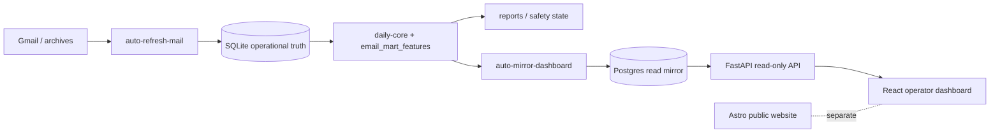

# OrigenLab

<p align="center">
  <strong>Commercial operations monorepo</strong> — public website, email intelligence pipeline, read-only operator API, and dashboard.
</p>

<p align="center">
  <a href="https://github.com/rafaelRojasVi/origenlab/actions/workflows/email-pipeline.yml"></a>
  <a href="https://github.com/rafaelRojasVi/origenlab/actions/workflows/api.yml"></a>
  <a href="https://github.com/rafaelRojasVi/origenlab/actions/workflows/dashboard.yml"></a>
  <a href="https://github.com/rafaelRojasVi/origenlab/actions/workflows/web.yml"></a>
  <a href="https://github.com/rafaelRojasVi/origenlab/actions/workflows/secret-scan.yml"></a>
  
  
</p>

---

## What this is

OrigenLab combines a **public marketing site** with **operator tooling** for commercial email intelligence, outbound safety, and read-only triage. Gmail and archive signals land in **SQLite** on the operator machine; **Postgres** is a read-only dashboard mirror. The **API** and **dashboard** observe that mirror — they do not send mail or mutate outreach state.

This public repository holds **code, tests, and documentation only**. Mail exports, SQLite files, generated reports, and client collateral stay outside Git by design.

| Write path | Read-only surfaces |
|------------|-------------------|
| [`apps/email-pipeline`](apps/email-pipeline/) — ingest, mart, safety, explicit `--apply` workflows | [`apps/api`](apps/api/) `:8001` · [`apps/dashboard`](apps/dashboard/) `:5173` |

Full topology: [`docs/PROJECT_CONTEXT.md`](docs/PROJECT_CONTEXT.md) · outbound rules: [`apps/email-pipeline/docs/OUTBOUND_SOURCE_OF_TRUTH.md`](apps/email-pipeline/docs/OUTBOUND_SOURCE_OF_TRUTH.md)

## Operator surfaces

The active operator UI is [`apps/dashboard`](apps/dashboard/) (Streamlit was retired). All sections are **GET-only** against [`apps/api`](apps/api/).

| Section | Role |
|---------|------|
| **Hoy (Today)** | Daily summary, automation health card, queue counts |
| **Bandeja de revisión** | Warm-case triage with client-side filters and local review labels |
| **Licitaciones / equipos** | Equipment-first public-tender queue from the Postgres read model |
| **Sistema** | Service status, read-only policy, backend/mirror context |

Handoff and freeze rules: [`apps/dashboard/docs/V1_FREEZE_OPERATOR_HANDOFF.md`](apps/dashboard/docs/V1_FREEZE_OPERATOR_HANDOFF.md)

## Architecture



| Layer | Role |
|-------|------|
| Gmail / archives | External source (not in Git) |
| SQLite | Operational truth — ingest, outbound safety, Sent memory |
| Postgres | Read-only dashboard/reporting mirror |
| API / dashboard | Read-only operator surfaces; mirror data is **not** send approval |
| `apps/web` | Public marketing site (separate from operator stack) |

Two debounced cron loops keep ingest and publish separate: Gmail → SQLite (~3 min) and SQLite → Postgres/dashboard (~15 min). Runbook: [`apps/email-pipeline/docs/pipeline/OPERATOR_CRON.md`](apps/email-pipeline/docs/pipeline/OPERATOR_CRON.md)

## Applications

| App | Path | Stack | Writes? |
|-----|------|-------|---------|
| **Web** | [`apps/web/`](apps/web/) | Astro, Tailwind, TypeScript | No operational data |
| **Email pipeline** | [`apps/email-pipeline/`](apps/email-pipeline/) | Python 3.12, `uv`, SQLite | Yes — local SQLite/reports when explicitly applied |
| **Operator API** | [`apps/api/`](apps/api/) | FastAPI `:8001` | No mutation |
| **Dashboard** | [`apps/dashboard/`](apps/dashboard/) | React, Vite `:5173` | No mutation |

**Default ports:** API `:8001` · Dashboard `:5173` · Web `:4321`

## Source-of-truth boundaries

- **SQLite** — operational truth for ingest, outbound safety, and send decisions.
- **Postgres** — read-only reporting mirror after `auto-mirror-dashboard` publishes.
- **API / dashboard** — read-only; never treat mirror responses as send approval.
- **Send / outreach** — human-reviewed batches via email-pipeline scripts; **no autonomous send path**.
- **Generated datasets** — `reports/out`, SQLite, and mail exports stay out of Git.

## Validation and audits

| Check | Command | Notes |
|-------|---------|-------|
| **Active operator stack** | [`./scripts/validate-active-stack.sh`](scripts/validate-active-stack.sh) | email-pipeline + API + dashboard; no send/purge |
| **Public-repo hygiene** | [`./scripts/security/check-public-repo-hygiene.sh`](scripts/security/check-public-repo-hygiene.sh) | Tracked files only; no network |
| **Remote response audit** | `apps/api/scripts/remote_response_audit.py` | Live GET contract checks behind Cloudflare Access; skips without CF credentials |
| **Remote latency audit** | `apps/api/scripts/remote_latency_audit.py` | Warm-run latency budgets; cold probe advisory |

Per-app CI: `./scripts/validate.sh` inside each app. Heavier monorepo sweep: [`./scripts/check-all.sh`](scripts/check-all.sh)

Before changing repo visibility: [`docs/PUBLIC_RELEASE_CHECKLIST.md`](docs/PUBLIC_RELEASE_CHECKLIST.md)

## Quick start

**Website**

```bash
cd apps/web && npm ci && npm run dev
```

**Operator API + dashboard**

```bash
cd apps/api && uv sync && uv run uvicorn origenlab_api.main:app --host 127.0.0.1 --port 8001
cd apps/dashboard && npm ci && npm run dev   # expects API on :8001
```

**Email pipeline — read-only status**

```bash
cd apps/email-pipeline && uv sync && uv run origenlab operator-automation-status
```

Do not run `--apply`, send, purge, or mirror workflows from this README. See app runbooks for operator procedures.

## Security

This repository is **public**. Do not commit `.env`, SQLite databases, mail archives, `reports/out`, keys, or client collateral.

| Control | Location |
|---------|----------|
| Coordinated disclosure | [`SECURITY.md`](SECURITY.md) |
| Public-repo guide | [`docs/SECURITY_PUBLIC_REPO.md`](docs/SECURITY_PUBLIC_REPO.md) |
| Secret scan (gitleaks) | [`.github/workflows/secret-scan.yml`](.github/workflows/secret-scan.yml) |
| Dependabot | [`.github/dependabot.yml`](.github/dependabot.yml) |

## Documentation

| Topic | Doc |
|-------|-----|
| Monorepo architecture | [`docs/PROJECT_CONTEXT.md`](docs/PROJECT_CONTEXT.md) |
| Documentation map | [`docs/DOCUMENTATION_MAP.md`](docs/DOCUMENTATION_MAP.md) |
| Release process | [`docs/RELEASE_PROCESS.md`](docs/RELEASE_PROCESS.md) |
| Email pipeline | [`apps/email-pipeline/docs/README.md`](apps/email-pipeline/docs/README.md) |
| Operator API | [`apps/api/README.md`](apps/api/README.md) |
| Dashboard handoff | [`apps/dashboard/docs/V1_FREEZE_OPERATOR_HANDOFF.md`](apps/dashboard/docs/V1_FREEZE_OPERATOR_HANDOFF.md) |
| Web app | [`apps/web/docs/README.md`](apps/web/docs/README.md) |
| Contributing | [`CONTRIBUTING.md`](CONTRIBUTING.md) |

## License

MIT — see [`LICENSE`](LICENSE).
