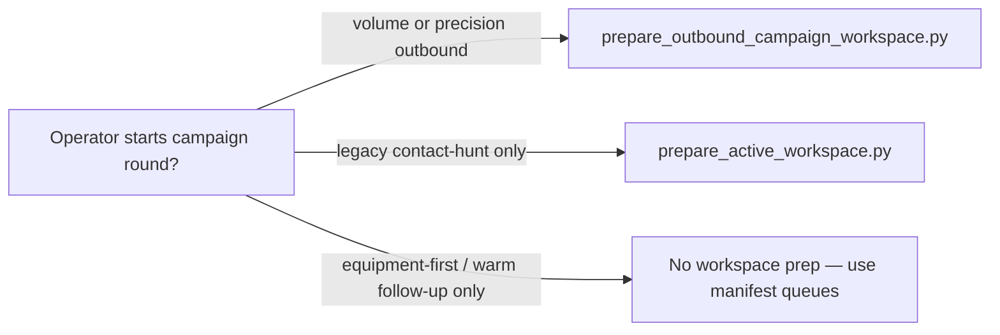

# Operator cheat sheet — which script should I run?

**Status:** canonical (operator aid)  
**Owner:** email-pipeline-maintainers  
**Last reviewed:** 2026-05-19

Short answers for day-to-day work. **Canonical procedures and tables:** [`SCRIPT_MAP.md`](SCRIPT_MAP.md) · [`RUNBOOK.md`](RUNBOOK.md). This page is **not** a substitute for those runbooks.

---

## 0. Read-only status (agents + operators)

| | |
|--|--|
| **Run** | `uv run python scripts/qa/operator_status.py` or `make doctor` |
| **Produces** | Verdict **READY / CAUTION / BLOCKED**; SQLite/Sent/DNR freshness; `campaign_mode` + operator focus from manifest |
| **Index** | [`reports/out/active/current/manifest.json`](../reports/out/active/current/manifest.json) · [`AGENTS.md`](../AGENTS.md) |

**Daily runtime truth (default):** **SQLite** + ingested **Gmail Sent** + anti-repeat CSVs (`do_not_repeat_master`, `outreach_contacted_all`) — not Postgres, not the React dashboard, not API mirrors. **Opportunity workflow:** equipment-first queues (`equipment_first_operator_queue_*`, `buyer_opportunity_ab_queue_*`). See [`EXPERIMENTAL_PARKED.md`](EXPERIMENTAL_PARKED.md) for what is optional.

**Lead-account / advanced paths:** Use canonical **`scripts/leads/advanced/*`** in new docs and agent prompts. Root-level wrappers were **removed in Phase 5B** — see [`SCRIPT_MAP.md`](SCRIPT_MAP.md#lead-account-scripts-canonical).

---

## 1. Normal outbound safety refresh

| | |
|--|--|
| **Run** | `uv run python scripts/qa/refresh_outbound_safety_memory.py` (or the same steps manually — see [`RUNBOOK.md`](RUNBOOK.md) daily outbound / anti-repeat sequence) |
| **Produces** | Refreshed CSVs under `reports/out/active/` (e.g. contacted-all, all-known marketing, DNR master, hygiene/readiness checks per [`SCRIPT_MAP.md`](SCRIPT_MAP.md)) |
| **When** | Before a new send cycle, after major mailbox changes, or when anti-repeat artifacts may be stale |

---

## 1b. Workspace prep — which script?

**Rule for agents:** Do **not** run any workspace prep script unless the operator **explicitly** starts a campaign round.

| Script | Status | Use for |
|--------|--------|---------|
| [`scripts/qa/prepare_outbound_campaign_workspace.py`](../scripts/qa/prepare_outbound_campaign_workspace.py) | **Canonical** for current outbound/campaign workspace | Volume/precision campaign workspace preparation; resets `active/current/` for DNR + send lists |
| [`scripts/leads/advanced/prepare_active_workspace.py`](../scripts/leads/advanced/prepare_active_workspace.py) | **Legacy / hunt / advanced** | Old advanced lead-hunt flows only — broader `reports/out/active/` hygiene |
| **Do not use** `prepare_active_workspace.py` for | — | Equipment-first tender work, `operator_status`, or normal `active/current/` without a hunt-style round |

More detail: [`SCRIPT_INVENTORY.md`](SCRIPT_INVENTORY.md#workspace-prep-which-script).

---

## 2. Broad / volume marketing lane

**Not daily default** while `manifest.json` `campaign_mode` is `equipment_first`. Run this lane only when starting an active volume campaign.

| Step | Script | Output / role |
|------|--------|----------------|
| DNR input | `scripts/qa/export_do_not_repeat_master.py` | `active/current/do_not_repeat_master.*` |
| Validate reviewed CSV | `scripts/qa/validate_campaign_csvs.py` … `--kind marketing_contacts` | Exit code / JSON |
| Gate + split | `scripts/leads/process_broad_marketing_contacts.py` | `send_ready_marketing.csv`, splits, summary JSON |

**Do not skip:** `validate_campaign_csvs.py` (strict), gate-backed processor, and **Sent history** in SQLite (ingest) before trusting exports — see [`RUNBOOK.md`](RUNBOOK.md) and [`OUTBOUND_SOURCE_OF_TRUTH.md`](OUTBOUND_SOURCE_OF_TRUTH.md).

---

## 3. Precision lead / research lane

**Not daily default** while `campaign_mode` is `equipment_first`. Requires an explicit campaign round.

| Step | Script | Output / role |
|------|--------|----------------|
| Prepare workspace | `scripts/qa/prepare_outbound_campaign_workspace.py` | `active/current/` campaign layout (**canonical** prep) |
| Queue export | `scripts/leads/export_lead_contact_research_queue.py` | **Requires `--out`:** you choose the CSV path. `research_queue.csv` (often under `active/current/`) is a **convention / example** from [`SCRIPT_MAP.md`](SCRIPT_MAP.md), not a default filename. |
| Import reviewed rows | `scripts/leads/import_lead_contact_research_csv.py` | **`--apply`** required to write DB |
| Orchestrator | `scripts/leads/run_current_campaign_pipeline.py` | `prepare` / `process-reviewed` / `post-send` stages |

**Human review:** reviewed DeepSearch CSV, `send_ready.csv`, and any draft content — nothing auto-sends.

---

## 4. After sending emails

1. **Gmail Sent → SQLite:** `scripts/ingest/05_workspace_gmail_imap_to_sqlite.py` (correct Sent folder label — [`RUNBOOK.md`](RUNBOOK.md)). **`--help` is safe**; a **normal ingest** run **writes to SQLite** and **contacts Gmail/IMAP**. **`--list-folders`** (see `--help`) lists mailbox labels and **exits before** opening SQLite for ingest — that path is **not** a substitute for understanding that default ingest mutates the DB.
2. **Mark batch contacted:** `scripts/leads/mark_sent_batch_contacted.py` (`--batch-file`, `--source`, `--updated-by`).
3. **Manual outreach sidecar (no Sent sync):** `scripts/leads/mark_outreach_state.py` — **dry-run default**; preview with `--updated-by`, `--source`, `--reason`, then **`--apply`** to write `outreach_contact_state` ([`CRUD_SAFETY.md`](CRUD_SAFETY.md#phase-2c-pilot-mark_outreach_statepy-implemented)).
4. **Refresh safety memory again** (§1) so the next export sees Sent + state truth.

---

## 5. Research automation

| Mode | Script | Note |
|------|--------|------|
| Heavy / light | `scripts/research/run_deep_research_prospecting.py` | `--research-mode heavy` = true Deep Research models only; light = cheaper daily rotation (see [`SCRIPT_MAP.md`](SCRIPT_MAP.md) and [`DEEP_RESEARCH_AUTOMATION_PLAN.md`](DEEP_RESEARCH_AUTOMATION_PLAN.md)) |

**Does not send:** stops before live send; you review artifacts under `active/current/research_automation/…`.

---

## 6. Archive / revival lane

| Script | Use |
|--------|-----|
| `scripts/leads/build_archive_send_batch.py` | **`contact_master`** / archive-derived batch: audit, shortlist, precheck, `send_ready` / review paths |

**Different from** `scripts/leads/export_next_marketing_recipients.py`, which exports **`lead_master`** through the shared gate for the **lead** lane. That CLI **requires `--out` / `-o`**; **`send_ready.csv`** is a **recommended filename / convention**, not an automatic default (same shared gate family, different lane — [`SCRIPT_MAP.md`](SCRIPT_MAP.md) archive vs daily table).

---

## 7. Maintenance / audit only (read-only or planning)

| Script | Role |
|--------|------|
| `scripts/qa/check_outbound_readiness.py` | Readiness / config checks |
| `scripts/qa/validate_contacted_csv_coverage.py` | Strict CSV coverage vs gate inputs (often in refresh chain) |
| `scripts/qa/plan_script_consolidation.py` | **Planning:** classifies `scripts/` — no file changes |
| `scripts/qa/plan_reports_out_cleanup.py` | **Planning:** `reports/out` buckets — no file changes |

---

## 8. Commercial React dashboard (read-only, **not daily runtime**)

**Parked / experimental:** [`EXPERIMENTAL_PARKED.md`](EXPERIMENTAL_PARKED.md) — Postgres, FastAPI, and React are **optional mirrors**. **Not** required for send safety, DNR, or equipment-first export.

**Use canonical `scripts/leads/advanced/*` in new docs** — see [§0 daily truth](#0-read-only-status-agents--operators). **Do not** confuse this section with [§1 daily safety refresh](#1-normal-outbound-safety-refresh).

| Question | Answer |
|----------|--------|
| Where is truth for sends/gates? | **SQLite** + ingested **Gmail Sent** + anti-repeat CSVs — [RUNBOOK daily outbound](RUNBOOK.md#m-eprun-daily-outbound) |
| What does React read? | **Postgres mirror** via FastAPI only |
| Is Postgres/API required today? | **No** — `manifest.json`: `postgres_status` / `api_status` = `parked` |
| Do new Gmail messages appear automatically? | **No** — see RUNBOOK [canonical dashboard chain](RUNBOOK.md#canonical-dashboard-refresh-chain) |
| Default API scope | **Canonical** `contacto@origenlab.cl` (not full archive) |

**Single source of truth for commands** (no duplicate chain here):

- **Full refresh chain:** [`RUNBOOK.md` — Optional dashboard preview stack](RUNBOOK.md#m-eprun-dashboard-optional) · anchor [`#m-eprun-dashboard-gmail-to-react`](RUNBOOK.md#m-eprun-dashboard-gmail-to-react)
- **Future CLI modes (design only):** [`dashboard_stack_simplification_design_20260519.md`](../reports/out/active/current/dashboard_stack_simplification_design_20260519.md)
- **Panel README:** [`apps/dashboard/README.md`](../../dashboard/README.md)

**Experimental wrapper (dashboard-only until redesign):** `scripts/ops/refresh_operational_dashboard_stack.py` — prefer explicit RUNBOOK steps today; Gmail off by default; `--dry-run` prints only ([`EXPERIMENTAL_PARKED.md`](EXPERIMENTAL_PARKED.md)).

**OC promote (CEAF 26172):** `promote_purchase_order_event.py` — see RUNBOOK dashboard section.

---

## 9. Equipment-first tender opportunities (**current opportunity workflow**)

Default `campaign_mode` in [`manifest.json`](../reports/out/active/current/manifest.json): **`equipment_first`**.

| Step | Script | Output |
|------|--------|--------|
| Filter tenders | `scripts/qa/build_equipment_first_opportunity_queue.py` | `equipment_first_opportunity_queue_YYYYMMDD.csv` |
| Operator queue | `scripts/qa/build_equipment_first_operator_queue.py` | `equipment_first_operator_queue_YYYYMMDD.csv` + aligned `buyer_opportunity_ab_queue_YYYYMMDD.csv` |

**Makefile:** `make equipment-queue` or `make equipment-queue DATE_SUFFIX=YYYYMMDD`.

**Rules:** equipment-first only; consumables SEREMI/hospital codes excluded; **no invented buyer emails**; active tenders via **Mercado Público** / supplier quotes — **not** cold send-ready. See [`RUNBOOK.md`](RUNBOOK.md#m-eprun-equipment-first-opportunities) and [`reports/out/active/current/README_ACTIVE_CURRENT.md`](../reports/out/active/current/README_ACTIVE_CURRENT.md).

**Stale:** `buyer_opportunity_crosscheck_*.csv` — not for export after manual sends until regenerated.

---

## 10. Do not run casually

- **Postgres migrate / mirror / dashboard stack:** see [`EXPERIMENTAL_PARKED.md`](EXPERIMENTAL_PARKED.md) — **not daily runtime**; explicit approval required.
- **Postgres migrate:** `scripts/migrate/sqlite_*_to_postgres.py` — **optional**; scratch DB first; see [`RUNBOOK.md`](RUNBOOK.md#m-eprun-postgres-optional).
- **Send mail:** `scripts/qa/send_inline_html_email_via_gmail_api.py` — break-glass; can send real mail.
- **Purge / mart rebuild / commercial rebuild / extract rebuild** — break-glass; read `--help` and [`SCRIPT_MAP.md`](SCRIPT_MAP.md#break-glass-scripts).
- **Bounce sync writes:** `scripts/qa/sync_outreach_batch_from_ingested_bounces.py` — review evidence; **`--apply`** mutates state.

---

## 11. If confused

1. Open **[`SCRIPT_MAP.md`](SCRIPT_MAP.md)** (operator index) then **[`RUNBOOK.md`](RUNBOOK.md)** (step-by-step).
2. Do **not** guess between two similarly named scripts — e.g. workspace prep: [`SCRIPT_INVENTORY.md`](SCRIPT_INVENTORY.md#workspace-prep-which-script) (stable anchor).
3. Do **not** bypass **DNR**, **export gate**, or **Sent-history** checks — they are intentional fail-closed safety.

**Postgres / API / React:** optional — [`EXPERIMENTAL_PARKED.md`](EXPERIMENTAL_PARKED.md). Simplification audit: [`reports/out/active/current/code_quality_simplification_audit_20260519.md`](../reports/out/active/current/code_quality_simplification_audit_20260519.md).
