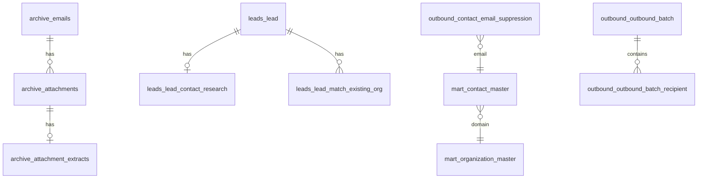

# PostgreSQL + FastAPI commercial dashboard — architecture plan

> **Status: historical design document.** The **active** read-only HTTP API is [`apps/api`](../../../api/README.md) on port **8001** (`GET /mirror/*` for Postgres mirror reporting; operator routes for Dashboard Today). Legacy email-pipeline FastAPI on **:8000** (`apps/email-pipeline/src/origenlab_api`) was **removed** in API-3 Phase 6. **Current architecture:** [`docs/PROJECT_CONTEXT.md`](../../../../docs/PROJECT_CONTEXT.md) · [`apps/api/README.md`](../../../api/README.md) · [API-3 removal note](../../../api/docs/API-3_PHASE6_LEGACY_REMOVAL_COMPLETE.md). Body text below may still name removed paths for design history.

**Status:** historical design (no production cutover; superseded by apps/api)  
**Date:** 2026-05-15  
**Owner:** email-pipeline maintainers  
**Audience:** backend / product engineering  

**Related (existing truth):**

- Operational OLTP today: **SQLite** (`ORIGENLAB_SQLITE_PATH`) — ingest, mart rebuild, gates, Streamlit.
- Postgres design baseline: [`../pipeline/POSTGRES_SCHEMA_TARGET_V1.md`](../pipeline/POSTGRES_SCHEMA_TARGET_V1.md), [`../pipeline/POSTGRES_ARCHIVE_DATA_MIGRATION_PLAN_V1.md`](../pipeline/POSTGRES_ARCHIVE_DATA_MIGRATION_PLAN_V1.md).
- Audit of current state: [`../audits/POSTGRES_API_PIPELINE_MESS_AUDIT.md`](../audits/POSTGRES_API_PIPELINE_MESS_AUDIT.md).
- Operator UI: `apps/business_mart_app.py` (Streamlit, **unchanged** in this plan).

**Hard constraints (this initiative):**

- Do **not** migrate production SQLite data yet.
- Do **not** mutate SQLite from the API.
- Do **not** send email from the API in v0.
- Do **not** remove Streamlit.
- Do **not** build a large REST surface blindly — ship a **minimal vertical slice** first.

---

## 1. Executive summary

OrigenLab’s email pipeline is a mature **CLI + SQLite + Streamlit** system. PostgreSQL already has **Alembic migrations** and **optional** SQLite→Postgres loaders, but Postgres is **not** the daily runtime database.

The next step is a **commercial dashboard backend** that:

1. Uses **PostgreSQL** as the **read-optimized + workflow-durable** store for productized views and operator actions.
2. Exposes a **small FastAPI** service for dashboard clients (future web app, internal tools).
3. Leaves **SQLite** as the **ingest and batch-job OLTP** until a deliberate, tested cutover.

**Strategic split:**

| Layer | SQLite (now) | PostgreSQL (target) |
|-------|----------------|---------------------|
| Gmail ingest, attachment extract | **Primary write path** | Replica / optional archive copy |
| Mart rebuild jobs | **Primary** | Refresh into `mart.*` on schedule |
| Outbound safety (suppression, state) | **Primary** | **Mirror + API writes** (later) |
| Lead / commercial review | **Primary** | **Mirror + API writes** (slice 2+) |
| Marketing batch CSV artifacts | Files under `reports/out/` | **Audit rows** in `outbound.*` + file pointers |
| Streamlit | **Direct SQLite** | Unchanged; may call API for new flows only |

---

## 2. Answers to the ten design questions

### 2.1 What should PostgreSQL be used for?

Postgres should be the **dashboard and integration database**, not the ingest engine.

**Use Postgres for:**

1. **Queryable commercial views** — contacts, orgs, opportunities, lead queues, supplier browse (pagination, filters, stable types).
2. **Durable workflow state** — suppression, outreach state, lead contact research, commercial candidate review, supplier review (operator mutations with audit).
3. **Export / batch audit** — `outbound.outbound_batch` + recipients (already partially implemented via `--write-postgres-audit`).
4. **Report and run metadata** — `reporting.report_run`, artifact pointers (paths, checksums).
5. **Future multi-client access** — one connection pool, row-level security later, read replicas for analytics.
6. **Optional full archive replica** — `archive.*` for BI without opening multi-GB SQLite on laptops.

**Do not use Postgres (yet) for:**

- Live Gmail ingest writes.
- Mart rebuild **source of truth** during transition (rebuild still runs on SQLite; publish to Postgres after).

### 2.2 Which SQLite tables should map into Postgres?

Follow the existing target map in `POSTGRES_SCHEMA_TARGET_V1.md`. Summary by **priority tier**:

**Tier A — first dashboard slice (durable + high read value)**

| SQLite | Postgres | Why |
|--------|----------|-----|
| `outreach_contact_state` | `outbound.outreach_contact_state` | “Already contacted” memory |
| `contact_email_suppression` | `outbound.contact_email_suppression` | Do-not-contact |
| `contact_domain_suppression` | `outbound.contact_domain_suppression` | Domain blocks |
| `lead_master` | `leads.lead` | Prospecting browse |
| `lead_contact_research` | `leads.lead_contact_research` | Operator research status |
| `contact_master` | `mart.contact_master` | Contact rollups |
| `organization_master` | `mart.organization_master` | Org rollups |
| `opportunity_signals` | `mart.opportunity_signals` | Opportunity KPIs |
| *(new)* | `outbound.outbound_batch`, `outbound.outbound_batch_recipient` | Batch audit |

**Tier B — commercial workflow (slice 2)**

| SQLite | Postgres |
|--------|----------|
| `contact_candidate`, `organization_candidate`, `opportunity_candidate` | `commercial.*_candidate` |
| `candidate_review_event`, `candidate_manual_override` | `commercial.candidate_*` |
| `commercial_*_rollup`, `commercial_email_signal_fact` | `commercial.*` (rebuildable) |

**Tier C — supplier lane**

| SQLite | Postgres |
|--------|----------|
| `supplier_master`, `supplier_evidence`, `supplier_contact_channel`, `supplier_review_state`, … | `supplier.*` |

**Tier D — archive (heavy, optional early)**

| SQLite | Postgres |
|--------|----------|
| `emails`, `attachments`, `attachment_extracts` | `archive.*` |

**Tier E — ops metadata**

| SQLite | Postgres |
|--------|----------|
| `pipeline_run`, `pipeline_kv` | `ops.pipeline_*` |

**Views to recreate in Postgres:** `v_commercial_candidate_queue`, `v_lead_match_summary`.

### 2.3 Should Postgres store raw archive data, curated mart data, or both?

**Both, but at different lifecycles.**

| Data class | Store in Postgres? | Role |
|------------|-------------------|------|
| **Raw archive** (`archive.*`) | **Yes, eventually** | Analytics, full-text search, cross-team BI; loaded by batch migrate, append-oriented |
| **Curated mart** (`mart.*`) | **Yes, early** | Dashboard KPIs and browse; **rebuildable** from archive + rules |
| **Durable workflow** (`outbound.*`, `leads.*` research, `commercial.*` candidates) | **Yes, early** | Must not be wiped by mart rebuild; API may write here in later slices |
| **CSV under `reports/out/`** | **No (not canonical)** | Artifacts only; Postgres holds **pointers + summary JSON** in `reporting.*` / `outbound.*` |

**Phase recommendation:**

- **Phase 0–1:** mart + outbound + leads (no full `archive.emails` body text).
- **Phase 2:** archive headers + attachment metadata (no bodies in API responses).
- **Phase 3:** optional bodies / extracts for search (storage cost + PII policy).

### 2.4 What should remain SQLite-only for now?

Until explicit cutover sign-off:

| Concern | Stay on SQLite |
|---------|----------------|
| **Gmail / mbox ingest** | All writes to `emails`, `attachments`, `attachment_extracts` |
| **Mart rebuild jobs** | `build_business_mart`, commercial signal rebuilds, lead matching jobs |
| **CLI gates** | `process_broad_marketing_contacts`, export scripts (read SQLite `GateContext`) |
| **Streamlit default path** | Existing pages keep `sqlite3` connections |
| **One-off scripts / QA** | Majority of `scripts/` remain SQLite-first |
| **Attachment files on disk** | Binary storage unchanged |

Postgres consumers must treat SQLite as **authoritative for ingest freshness** until sync lag is monitored and acceptable.

### 2.5 What dashboard workflows justify a FastAPI backend?

Workflows that need **stable contracts**, **pagination**, **auth**, or **non-Python clients** — not “reimplement Streamlit in REST.”

| Workflow | Streamlit today | Why API |
|----------|-----------------|--------|
| **Outbound readiness** | `assess_outbound_readiness`, sidebar KPIs | Single JSON contract for future React dashboard |
| **Do-not-repeat / suppression browse** | Direct SQL + inline edits | CRUD with validation + audit trail |
| **Lead browse + contact research** | `streamlit_leads_browse`, upsert research | Mobile / external CRM integration |
| **Marketing / archive batch history** | CSV folders only | List batches, drill into recipients |
| **Commercial candidate queue** | Heavy SQL in app | Filter/sort/page without loading full DataFrame |
| **Supplier browse** | `streamlit_suppliers_browse` | Same |
| **Report catalog** | Scattered paths in `reports/out/` | `reporting.report_run` index |

**Low priority for API (keep CLI/Streamlit):**

- Mart rebuild triggers, Gmail ingest, deep research automation, attachment extraction.

### 2.6 What API endpoints are actually needed?

Versioned prefix: `/api/v1`. Auth: API key or OIDC (design now, implement in slice 1 as optional dev key).

#### Read-only (Phase 1)

| Method | Path | Purpose |
|--------|------|---------|
| `GET` | `/health` | Liveness + Postgres connectivity |
| `GET` | `/health/dependencies` | Postgres + optional SQLite reachability (read-only ping) |
| `GET` | `/meta/schema-versions` | Alembic head, sync watermark |
| `GET` | `/dashboard/summary` | KPI bundle (contacts, orgs, opportunities, suppression counts) |
| `GET` | `/contacts` | Paginated `mart.contact_master` (+ filters: domain, last_seen, tags) |
| `GET` | `/contacts/{email}` | Detail + linked opportunity signals |
| `GET` | `/organizations` | Paginated `mart.organization_master` |
| `GET` | `/organizations/{domain}` | Detail |
| `GET` | `/opportunities` | Paginated `mart.opportunity_signals` |
| `GET` | `/leads` | Paginated `leads.lead` |
| `GET` | `/leads/{id}` | Lead + research + match summary |
| `GET` | `/outbound/suppressions/emails` | List email suppressions |
| `GET` | `/outbound/suppressions/domains` | List domain suppressions |
| `GET` | `/outbound/contact-state` | Paginated outreach state |
| `GET` | `/outbound/batches` | List `outbound_batch` |
| `GET` | `/outbound/batches/{id}` | Batch + recipients |
| `GET` | `/outbound/readiness` | Wrap `assess_outbound_readiness` logic (inputs: gmail_user, folders) |

#### Write-enabled (Phase 2+, guarded)

| Method | Path | Purpose |
|--------|------|---------|
| `PUT` | `/outbound/suppressions/emails/{email}` | Upsert suppression (mirror SQLite policy) |
| `DELETE` | `/outbound/suppressions/emails/{email}` | Remove suppression |
| `PUT` | `/leads/{id}/contact-research` | Upsert `lead_contact_research` |
| `POST` | `/commercial/candidates/{id}/review-events` | Append review event |
| `POST` | `/outbound/batches` | Register batch metadata post-export (not send mail) |

#### Explicitly out of scope (v0–v1)

- `POST /email/send`, Gmail OAuth proxy, ingest triggers.
- `POST /mart/rebuild`, `POST /ingest/gmail`.
- Bulk archive search over full bodies (until archive tier loaded).

### 2.7 What should be read-only vs write-enabled?

| Domain | v1 (slice 1) | Later writes | Notes |
|--------|--------------|--------------|-------|
| `mart.*` | **Read-only** | None via API | Rebuild via CLI → sync job |
| `archive.*` | **Read-only** (when present) | None | Ingest stays SQLite |
| `leads.lead` | **Read-only** | Research upsert slice 2 | Import still CLI |
| `leads.lead_contact_research` | Read-only → **RW** | Streamlit parity | Validate same rules as `lead_contact_research.py` |
| `outbound.suppression*` | Read-only → **RW** | Streamlit parity | Same validation as `contact_email_suppression.py` |
| `outbound.outreach_contact_state` | **Read-only** | Optional mark-contacted | Prefer CLI `mark_sent_batch_contacted` until dual-write proven |
| `outbound.outbound_batch*` | **Read-only** | `POST` register batch | CLI already optional `--write-postgres-audit` |
| `commercial.*` | **Read-only** | Review events slice 2 | |
| `supplier.*` | **Read-only** | Review slice 3 | |

**Rule:** API writes only where there is **existing Python validation** in `origenlab_email_pipeline.*` modules; never raw SQL from handlers.

### 2.8 What should the first minimal API vertical slice be?

**Slice 1 — “Outbound memory read API”**

**Goal:** Prove FastAPI + Postgres + auth + pagination without touching SQLite writes or email send.

**In scope:**

1. FastAPI app skeleton: `apps/api/` or `apps/email-pipeline/src/origenlab_api/` (package TBD).
2. Postgres reads from:
   - `mart.contact_master` (top N + filter by domain)
   - `mart.organization_master`
   - `outbound.contact_email_suppression`
   - `outbound.outreach_contact_state`
   - `outbound.outbound_batch` + `outbound_batch_recipient` (if migrated)
3. Endpoints:
   - `GET /health`, `GET /health/dependencies`
   - `GET /dashboard/summary`
   - `GET /contacts`, `GET /organizations`
   - `GET /outbound/suppressions/emails`, `GET /outbound/contact-state`
   - `GET /outbound/batches`, `GET /outbound/batches/{id}`
   - `GET /outbound/readiness` (read-only assessment)
4. OpenAPI docs at `/docs`.
5. Docker Compose service **alongside** Streamlit — **deprecated:** legacy Slice-1 on port **8000**; **preferred:** `apps/api` on port **8001** (`/mirror/*`), shared env `ORIGENLAB_POSTGRES_URL`.
6. Tests: TestClient + Testcontainers Postgres (or pytest fixtures); **no** production DB.

**Data prerequisite:** Run existing loaders on **scratch Postgres** (not production):

```bash
uv sync --group postgres
uv run alembic upgrade head
uv run python scripts/migrate/sqlite_outbound_sidecars_to_postgres.py  # suppression + state
uv run python scripts/migrate/sqlite_document_master_to_postgres.py    # mart tables
```

**Out of scope for slice 1:**

- FastAPI writes, archive migrate, Streamlit refactor, frontend SPA.

**Slice 2 (follow-up):** `GET /leads`, `PUT /leads/{id}/contact-research`, suppression upsert with dual-write strategy.

**Slice 3:** Commercial candidate queue + review events.

---

### 2.9 How do we keep CLI / Streamlit working while adding Postgres / API?

**Pattern: “SQLite authoritative, Postgres published.”**

```
┌─────────────────┐     ingest/rebuild      ┌──────────────────┐
│  Gmail / CLI    │ ───────────────────────►│ SQLite (OLTP)   │
│  jobs           │                         │  source of truth │
└─────────────────┘                         └────────┬─────────┘
                                                     │
                              batch sync (idempotent)│
                                                     ▼
                                            ┌──────────────────┐
                                            │ PostgreSQL       │
                                            │ mart/outbound/   │
                                            │ leads/...        │
                                            └────────┬─────────┘
                                                     │ read
                                                     ▼
                                            ┌──────────────────┐
                                            │ FastAPI          │
                                            └────────┬─────────┘
                                                     │
                     ┌──────────────────────────────┼──────────────────────────────┐
                     ▼                              ▼                              ▼
              Future web SPA                  Streamlit (SQLite)              BI tools
              (reads API)                     unchanged default              (Postgres)
```

**Rules:**

1. **No dual-write in slice 1** — API read-only; operators continue Streamlit → SQLite.
2. **Sync jobs are explicit CLI** — e.g. extend `scripts/migrate/sqlite_*_to_postgres.py` with `--incremental` / watermark on `updated_at` (design now, implement per table).
3. **Shared validation library** — API and Streamlit call the same `origenlab_email_pipeline` functions for any future writes.
4. **Feature flag** — `ORIGENLAB_API_ENABLED=0` default; Streamlit never depends on API for core paths.
5. **Watermark table** — `ops.pipeline_kv` or `reporting.sync_watermark` stores last successful sync per table (avoid full truncate reload in production).

**Streamlit coexistence:**

- Keep `business_mart_app.py` on SQLite indefinitely for ops-heavy pages.
- Optional **new** sidebar section “API preview” that hits FastAPI only when configured (non-blocking).

**CLI coexistence:**

- Gates (`process_broad_marketing_contacts`, exports) **keep reading SQLite** until a signed cutover checklist passes.
- Optional `--write-postgres-audit` stays **additive** (already implemented).

---

### 2.10 What are the risks of migrating too early?

| Risk | Impact | Mitigation |
|------|--------|------------|
| **Dual truth** | Sends to suppressed contacts, wrong “contacted” state | SQLite remains write authority; sync lag metrics; no API writes until dual-write tested |
| **Truncate loaders on wrong DB** | Data loss in Postgres | Scratch-only trials; separate URLs; never point loaders at prod without backup |
| **Mart rebuild wipes operator state** | Lost research notes if tables merged | Schema separation (`mart` vs `leads` vs `outbound`); never rebuild durable tables from archive alone |
| **PII exposure via API** | Compliance / leak | Read scopes per endpoint; no full bodies in v1; auth + audit log |
| **Performance regression** | Slow dashboard | Indexes on Postgres; don’t mirror 10M-row bodies before need |
| **Reimplementing Streamlit** | Wasted effort, feature drift | API only for **new** clients; Streamlit stays |
| **Big-bang cutover** | Ops paralysis | Vertical slices; read API before write API before SQLite deprecation |
| **Email send in API** | Accidents | Explicit non-goal; send stays CLI with human gate |
| **Test / prod drift** | Alembic head ≠ loaded data | `GET /meta/schema-versions` + CI migrate smoke |
| **Over-building REST** | Maintenance burden | Endpoint list gated per slice; OpenAPI as contract |

---

## 3. Proposed Postgres schema map (consolidated)

Schemas already defined in Alembic `20260419_0001` … `0005`. This is the **dashboard-relevant** subset.



| Schema | Tables (dashboard phase) | Sync source | Rebuildable? |
|--------|--------------------------|-------------|--------------|
| `archive` | `emails`, `attachments`, `attachment_extracts` | SQLite migrate | Append / immutable |
| `ops` | `pipeline_run`, `pipeline_kv` | SQLite / new | Durable |
| `mart` | `contact_master`, `organization_master`, `document_master`, `opportunity_signals` | Mart rebuild → migrate | **Yes** |
| `leads` | `lead`, `lead_contact_research`, `external_leads_raw`, matches | SQLite | Mixed |
| `commercial` | candidates, rollups, review events | SQLite | Mixed |
| `outbound` | suppressions, `outreach_contact_state`, `outbound_batch*` | SQLite + export audit | Durable |
| `supplier` | `supplier`, `evidence`, `review_state`, … | SQLite | Mixed |
| `reporting` | `report_run`, `report_artifact` | New (from `reports/out` indexer) | Audit |

**Column-type upgrades (Postgres vs SQLite):** timestamps → `TIMESTAMPTZ`, JSON text → `JSONB`, booleans → `BOOLEAN`, email keys → `CITEXT` (optional).

Full column-level map: see §4 in [`POSTGRES_SCHEMA_TARGET_V1.md`](../pipeline/POSTGRES_SCHEMA_TARGET_V1.md).

---

## 4. Migration / sync strategy (SQLite → Postgres)

**Principle:** batch **publish**, not live replication.

### Phase 0 — Foundation (current repo state)

- [x] Alembic schemas + archive/outbound/mart migrations exist.
- [x] Loaders: `sqlite_archive_to_postgres.py`, `sqlite_document_master_to_postgres.py`, `sqlite_outbound_sidecars_to_postgres.py`.
- [x] Validator: `validate_sqlite_archive_for_postgres.py`.
- [ ] **Production load:** explicitly **not** in this plan.

### Phase 1 — Dashboard dev environment

1. Disposable Postgres + `alembic upgrade head`.
2. Copy production SQLite → **staging file** (filesystem copy, not in-place).
3. Load **Tier A** only: outbound sidecars + mart (`sqlite_outbound_sidecars_to_postgres`, `sqlite_document_master_to_postgres`).
4. Run FastAPI slice 1 against staging Postgres.

### Phase 2 — Incremental sync (implement)

| Job | Frequency | Watermark | Idempotency |
|-----|-----------|-----------|-------------|
| `sync_mart_to_postgres` | After each mart rebuild | `mart_rebuilt_at` in `ops.pipeline_kv` | Upsert by natural key |
| `sync_outbound_to_postgres` | Hourly or on-demand | `max(updated_at)` | Upsert |
| `sync_leads_to_postgres` | After lead import | `lead_max(id)` | Upsert |
| `sync_archive_to_postgres` | Weekly (optional) | `email_max(id)` | Append-only batches |

**Never** auto-run truncate loaders against production Postgres without operator confirmation.

### Phase 3 — Cutover checklist (future, not now)

- [ ] Sync lag &lt; N minutes monitored 30 days.
- [ ] API read path used by internal SPA for core browse.
- [ ] Dual-write tested for suppression + research.
- [ ] Streamlit flag to read API for one page without regression.
- [ ] Rollback: API off, SQLite unchanged.

---

## 5. FastAPI application structure (proposed)

```
apps/email-pipeline/
  src/origenlab_api/           # new package (slice 1)
    main.py                    # FastAPI app factory
    deps.py                    # DB pool, settings
    routers/
      health.py
      dashboard.py
      contacts.py
      organizations.py
      outbound.py
    schemas/                   # Pydantic response models
    services/                  # thin; calls origenlab_email_pipeline where possible
  tests/test_api_*.py
```

**Dependencies:** reuse `origenlab_email_pipeline.config.load_settings`, add `ORIGENLAB_POSTGRES_URL`, SQLAlchemy 2 async or psycopg pool (match existing `postgres` optional group).

**Deployment (historical):** a second Compose service on port **8000** was the original Slice-1 target (removed in API-3 Phase 6). **Current operator guidance:** run **`apps/api` on :8001`** only for mirror reporting (`GET /mirror/*`) and Dashboard operator routes. Same `.env` as Streamlit (`ORIGENLAB_POSTGRES_URL`).

---

## 6. Non-goals (explicit)

- Replacing Streamlit or removing SQLite from ingest.
- Production data migration in this initiative.
- Public internet exposure without authentication.
- Gmail send, ingest, or mart rebuild via HTTP.
- GraphQL, gRPC, or event bus in v1.
- Replacing CSV marketing lane artifacts (files remain; audit complements).
- Postgres as sole system of record before checklist §4 Phase 3.

---

## 7. Recommended sequencing

| Step | Deliverable | Effort |
|------|-------------|--------|
| 1 | Approve this plan | — |
| 2 | Scratch Postgres + Tier A load documented in RUNBOOK | S |
| 3 | FastAPI slice 1 (read-only) + tests | M |
| 4 | `sync_*` watermark jobs (mart + outbound) | M |
| 5 | Internal SPA proof on `/contacts` + `/outbound/readiness` | M |
| 6 | Slice 2 writes (suppression, lead research) with dual-write design | L |
| 7 | Archive tier load + search API | L |
| 8 | Streamlit optional API page | S |
| 9 | Production Postgres load + cutover review | XL (separate project) |

---

## 8. Open decisions

1. **Monorepo placement:** `apps/api` vs `origenlab_api` inside `email-pipeline` — prefer **inside email-pipeline** to share package and tests.
2. **Auth:** API keys for internal v1 vs OIDC — decide before any write endpoints.
3. **Mart as table vs materialized view** — table + upsert sync for slice 1 (simpler); MV later.
4. **Whether `GET /outbound/readiness` hits SQLite or Postgres** — v1 can read Postgres mirrors only; document that readiness is **eventually consistent** until sync is frequent.

---

## 9. Success criteria for slice 1

**Implementation (2026-05-15):** package `src/origenlab_api/`, tests `tests/test_api_slice1.py`, RUNBOOK § [Read-only dashboard API](../RUNBOOK.md#m-eprun-api-slice1).

- [x] `uv run pytest tests/test_api_*` green with mocked Postgres (`tests/test_api_slice1.py`).
- [ ] `GET /dashboard/summary` returns non-empty counts against staging Postgres loaded from real SQLite copy.
- [ ] Streamlit + all existing CLI gates pass unchanged against production SQLite.
- [ ] No production SQLite mutations from API process.
- [ ] OpenAPI published; one example curl in RUNBOOK.

---

*This document is planning only. Implementation tracking should live in a separate issue/PR checklist when slice 1 starts.*
