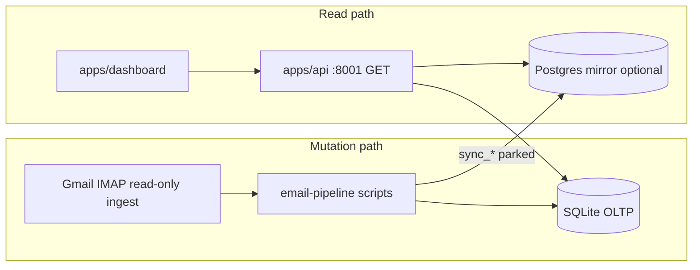

# Codebase simplification audit — email-pipeline, API, dashboard integration

**Status:** read-only audit (Phase 0); **Phase 1 doc map** applied 2026-06-02 in [`SCRIPT_MAP.md`](../SCRIPT_MAP.md) and [`RUNBOOK.md`](../RUNBOOK.md) (docs only)  
**Date:** 2026-06-02  
**Scope:** `apps/email-pipeline/scripts/{ingest,qa,mart,leads,tools,ops}`, `src/origenlab_email_pipeline`, `apps/api`, docs/tests that lock script paths, dashboard ↔ API integration  
**Authority for daily ops (unchanged):** [`SCRIPT_MAP.md`](../SCRIPT_MAP.md), [`RUNBOOK.md`](../RUNBOOK.md), [`reports/out/active/current/manifest.json`](../../reports/out/active/current/manifest.json)

**Related prior work:** [`POSTGRES_API_PIPELINE_MESS_AUDIT.md`](POSTGRES_API_PIPELINE_MESS_AUDIT.md), [`SCRIPT_CONSOLIDATION_NEXT_STEPS.md`](SCRIPT_CONSOLIDATION_NEXT_STEPS.md), [`reports/out/active/current/pipeline_health_automation_audit_2026_06_02/code_quality_notes.md`](../../reports/out/active/current/pipeline_health_automation_audit_2026_06_02/code_quality_notes.md)

---

## Executive summary

The email-pipeline stack is **operationally sound** but **organically large**: **191** Python files under `scripts/` (planner count), **265** under `src/origenlab_email_pipeline/`, with logic split between thin CLIs, very large audit scripts, and growing `src/` modules (especially campaigns, lead research, Postgres mirror, and `core/research_automation.py` at **~1,683** lines). Canonical operator truth is **already documented** (`SCRIPT_MAP`, `RUNBOOK`, `CRUD_SAFETY`, contract tests). The main maintenance cost is **not missing docs** — it is **surface area**, **overlapping entrypoints**, **date-stamped one-off orchestrators**, and **~90+ scripts** still using ad-hoc `sys.path.insert` instead of a single bootstrap.

**Strategic bias (aligned with project rules):**

1. **Stabilize SQLite + documented daily lanes** before any Postgres-first or “delete scripts” push.
2. **Extract behavior into `src/` with tests first**, then thin CLIs — especially for `build_business_mart.py`, `05_workspace_gmail_imap_to_sqlite.py`, and mega QA exports.
3. **Deprecate with warnings and grep evidence**, never silent removal of paths locked by `test_critical_script_paths.py` or `test_operator_entrypoint_contracts.py`.
4. **`apps/api` stays GET-only**; it may import email-pipeline **read models** but must never call mutation scripts (guarded in CI).

**apps/api:** Phase 6 removed legacy `:8000` FastAPI from email-pipeline. Active operator API is **`apps/api` on :8001** with SQLite operator routes + optional `GET /mirror/*` on Postgres. Dashboard v1 is frozen read-only; tests warn if env still points at `:8000`.

**Highest leverage:** (1) document/register “unknown” planner scripts in `SCRIPT_MAP`, (2) split mart + Gmail ingest + overlap audit scripts, (3) retire or archive historical `ops/run_*_2026_06_01*.sh`, (4) consolidate NDR tooling story around `flag_ndr_bounces_from_contacto.py`, (5) reduce `sys.path` boilerplate via `_bootstrap.py`, (6) optional Postgres mirror path stays **parked** behind `EXPERIMENTAL_PARKED.md`.

---

## Top 10 highest-value cleanup targets

| # | Target | Why | Suggested class | Risk |
|---|--------|-----|-----------------|------|
| 1 | `scripts/mart/build_business_mart.py` (~606 LOC, large `main()`) | Mart rebuild DELETEs tables; logic belongs in `src` with tests | **REFACTOR_SPLIT** | High |
| 2 | `scripts/ingest/05_workspace_gmail_imap_to_sqlite.py` (~365 LOC) | Daily Sent truth; IMAP/OAuth/insert loop in one file | **REFACTOR_SPLIT** | High |
| 3 | `scripts/qa/export_contacted_lead_overlap_audit.py` (~828 LOC) | Duplicates gate concepts; hard to maintain | **REFACTOR_SPLIT** | Medium |
| 4 | `scripts/qa/export_email_conversation_intelligence.py` (~802 LOC) | Large read-only export; low daily use | **REFACTOR_SPLIT** or **DEPRECATE_CANDIDATE** if unused | Medium |
| 5 | Two workspace prep scripts (`prepare_outbound_campaign_workspace` vs `leads/advanced/prepare_active_workspace`) | Operator confusion documented but still recurring | **KEEP_ENTRYPOINT** + doc consolidation only first | Medium |
| 6 | `scripts/ops/run_post_send_2026_06_01_refresh.sh` + `run_manual_outreach_2026_06_01_post_send_refresh.sh` | Historical; **broad NDR `--apply`** called out in SCRIPT_MAP | **DEPRECATE_CANDIDATE** → archive | High if reused |
| 7 | Four root lead-account shims (`scripts/build_lead_account_rollup.py`, etc.) | Documented **COMPATIBILITY_WRAPPER** | **COMPATIBILITY_WRAPPER** → warn, then remove in Phase 5 | Medium |
| 8 | `scripts/qa/build_buyer_opportunity_queue.py` (**LEGACY_DO_NOT_USE**) | Superseded by `build_equipment_first_*` | **DEPRECATE_CANDIDATE** (keep tests until removal) | Low |
| 9 | `scripts/tools/flag_reported_non_delivery_from_contacto.py` vs `flag_ndr_bounces_from_contacto.py` | Overlapping suppression apply paths; latter is post-send canonical | **DEPRECATE_CANDIDATE** (merge docs first) | High if wrong tool used |
| 10 | `sys.path.insert` in ~90 scripts + duplicate `gmail_workspace_oauth` top-level vs `core/gmail/` | Reproducibility / import hygiene | **REFACTOR_SPLIT** (bootstrap only) | Low |

---

## Do not touch without explicit approval

These are **safety-critical** or **contract-locked**. Internal refactors require targeted tests and operator sign-off.

| Asset | Path(s) | Reason |
|-------|---------|--------|
| Export gate policy | `src/origenlab_email_pipeline/candidate_export_gate.py`, `marketing_export_context.py`, `next_marketing_queue.py` | Single policy surface for Streamlit + CLIs |
| Outbound resolution | `src/origenlab_email_pipeline/outbound_core.py` | Sent folders, sender mailbox, run envelope |
| Outreach memory | `src/origenlab_email_pipeline/outreach_contact_state.py` | `contacted` / `replied` / `snoozed` sidecar |
| CSV contracts | `src/origenlab_email_pipeline/csv_contracts.py`, `scripts/qa/validate_campaign_csvs.py` | Lane input shape |
| DNR / anti-repeat exports | `scripts/qa/export_do_not_repeat_master.py`, `export_outreach_contacted_all.py`, `export_all_known_marketing_contacts.py`, `refresh_outbound_safety_memory.py` | Volume lane + refresh chain |
| Gmail → SQLite Sent | `scripts/ingest/05_workspace_gmail_imap_to_sqlite.py` | Sent-history blocking truth |
| Post-send marking | `scripts/leads/mark_sent_batch_contacted.py`, `run_current_campaign_pipeline.py` (post-send stage) | Sidecar updates |
| Precision import | `scripts/leads/import_lead_contact_research_csv.py` | `lead_contact_research` persistence |
| NDR apply (targeted) | `scripts/tools/flag_ndr_bounces_from_contacto.py` | Suppression writes — prefer allowlist apply |
| Suppression imports | `import_operator_outreach_blocklist.py`, `add_manual_contact_suppressions.py` | Blocklist → DB |
| Postgres migrate loaders | `scripts/migrate/sqlite_*_to_postgres.py` | TRUNCATE/delete on target PG |
| Purge tools | `scripts/tools/purge_*.py` | Cross-table DELETE |
| API read-only guard | `apps/api/tests/mirror/test_mirror_no_write_policy.py` | GET-only `/mirror`, no mutation script refs |
| Path existence tests | `tests/test_critical_script_paths.py`, `tests/test_operator_entrypoint_contracts.py`, `tests/test_lead_compatibility_wrappers.py` | CI locks paths and `--help` |

**Also avoid** without a migration plan: changing `GateContext` reason codes, Sent-folder defaults, `contacto@origenlab.cl` source predicates, or `reports/out/active/current/` manifest semantics.

---

## Duplicated / overlapping functionality

### Report / `reports/out` hygiene

| Tool | Role | Overlap |
|------|------|---------|
| `scripts/qa/plan_reports_out_cleanup.py` | Read-only bucket scan | Canonical **plan** |
| `scripts/tools/archive_reports_out_generated.py` | Move files to `archive/manual_cleanup/` (`--apply`) | **Execute** cleanup from plan |
| `scripts/qa/check_reports_out_active_hygiene.py` | Fail/warn on stray `active/` artifacts | **Validate** layout |

**Action:** Keep all three; document “plan → optional archive → hygiene check” in one RUNBOOK subsection (Phase 1).

### Workspace preparation

| Script | Folder | Audience |
|--------|--------|----------|
| `scripts/qa/prepare_outbound_campaign_workspace.py` | `active/current/` | **Daily outbound** (volume + precision) |
| `scripts/leads/advanced/prepare_active_workspace.py` | broader `active/` | **Lead hunt / reporting** legacy |

**Action:** Do not merge; strengthen cross-links only (already in `SCRIPT_INVENTORY.md`).

### Outbound export / memory refresh

| Script | Output / effect |
|--------|-----------------|
| `export_do_not_repeat_master.py` | DeepSearch / volume **input** list |
| `export_outreach_contacted_all.py` | Auxiliary contacted CSV |
| `export_all_known_marketing_contacts.py` | Dedup “all known” (overlaps DNR partially — **different job**) |
| `export_outreach_volume_rollup.py` | **Metrics** rollup (not a send list) |
| `refresh_outbound_safety_memory.py` | Subprocess chain running the above + validators |

**Action:** No deletion; optional refactor of `refresh_outbound_safety_memory.py` to import steps as functions instead of subprocess (Phase 3).

### Status / doctor / readiness

| Entry | Type |
|-------|------|
| `make doctor` | `operator_status.py` + `check_reproducibility.py` |
| `make audit` | `operator_status.py` + `check_outbound_readiness.py` |
| `scripts/qa/operator_status.py` | Canonical READY/CAUTION/BLOCKED report |
| `scripts/qa/run_daily_health_report.py` | NDR dry-run + drift + mirror JSON summary |
| `apps/api` `GET /operator/status` (via `operator_status_report`) | HTTP mirror of SQLite status |

**Action:** Document matrix in RUNBOOK (which to run pre-send vs post-send vs dashboard refresh). Not duplicates — different depth.

### Lead / account paths

| Root shim | Canonical |
|-----------|-----------|
| `scripts/build_lead_account_rollup.py` | `scripts/leads/advanced/build_lead_account_rollup.py` |
| (+ 3 siblings) | (+ 3 siblings) |

### Postgres / dashboard / API (parked)

| Layer | Scripts | API |
|-------|---------|-----|
| SQLite OLTP | Daily lanes, gate, ingest | `apps/api` SQLite routes |
| Mirror load | `sync/sync_dashboard_postgres_mirror.py`, `ops/refresh_render_dashboard_once.sh`, per-domain `_refresh_*_mirror.sh` | `GET /mirror/*` |
| Break-glass migrate | `scripts/migrate/sqlite_*_to_postgres.py` | N/A |

**Risk:** Operators treating `mirror_ok` or dashboard “LISTO” as send approval — already warned in dashboard tests; keep copy.

### Legacy / obsolete paths

| Item | Evidence |
|------|----------|
| `scripts/qa/build_buyer_opportunity_queue.py` | Header `LEGACY_DO_NOT_USE`; AGENTS.md; manifest `legacy_do_not_use` |
| `apps/email-pipeline` FastAPI `:8000` | Removed API-3 Phase 6; dashboard tests for `:8000` warning |
| `scripts/tools/flag_reported_non_delivery_from_contacto.py` | Only self + SCRIPT_MAP reference; post-send doc prefers `flag_ndr_*` |
| `scripts/leads/advanced/export_archive_outreach_candidates.py` | Docstring: use `build_archive_send_batch.py --audit-only` |

### Ingest paths

| Script | Use |
|--------|-----|
| `05_workspace_gmail_imap_to_sqlite.py` | **Canonical** Workspace Gmail (`gmail:user/folder`) |
| `04_imap_to_sqlite.py` | Legacy Titan/password IMAP (`imap:...`) |
| `02_mbox_to_sqlite.py` | Historical mbox; **deletes all emails** on run — break-glass in RUNBOOK |
| `03_sqlite_to_jsonl.py` | Export JSONL for ML/Tatiana — not daily |

---

## Script inventory (scoped folders)

**Legend — classification:** A=KEEP_CORE, B=KEEP_ENTRYPOINT, C=REFACTOR_SPLIT, D=COMPATIBILITY_WRAPPER, E=DEPRECATE_CANDIDATE, F=REMOVE_CANDIDATE, G=BREAK_GLASS  

**Risk:** low / medium / high (blast radius if mis-run)

**References column:** `docs` = mentioned in SCRIPT_MAP/RUNBOOK/README; `tests` = referenced from `apps/email-pipeline/tests`; `ci` = Makefile or contract tests.

Planner baseline: `uv run python scripts/qa/plan_script_consolidation.py` → **132** Python files in scoped folders; **19** planner-labeled `unknown` (mostly new 2026-06 campaign/mirror scripts — need SCRIPT_MAP rows).

### Daily outbound & safety chain (detail)

| Path | Purpose | Imports from (typical) | Refs | Class | Risk | Recommended action | Tests to run |
|------|---------|------------------------|------|-------|------|-------------------|--------------|
| `scripts/qa/export_do_not_repeat_master.py` | DNR master CSV/JSON | `core.outbound.do_not_repeat_master`, gate helpers | docs, tests | B | med | Thin CLI only; keep | `pytest tests/test_export_do_not_repeat_master.py` |
| `scripts/qa/export_outreach_contacted_all.py` | Contacted-all auxiliary | `outreach_contact_state`, `outbound_core` | docs, tests | B | med | Keep | `test_export_outreach_contacted_all.py` |
| `scripts/qa/refresh_outbound_safety_memory.py` | Subprocess refresh chain | subprocess → sibling scripts | docs, tests | B | med | Optional: in-process steps (Phase 3) | `test_refresh_outbound_safety_memory.py` |
| `scripts/qa/validate_campaign_csvs.py` | CSV contracts | `csv_contracts` | docs, tests | B | low | Keep | `test_validate_campaign_csvs.py` |
| `scripts/leads/process_broad_marketing_contacts.py` | Volume lane processor | `core.outbound.broad_marketing_contacts`, gate | docs, tests | B | high | Keep | `test_process_broad_marketing_contacts.py` |
| `scripts/leads/run_current_campaign_pipeline.py` | Precision orchestrator | multiple `src` modules | docs, tests | B | high | Keep | `test_run_current_campaign_pipeline.py` |
| `scripts/leads/export_next_marketing_recipients.py` | `send_ready.csv` | `next_marketing_queue`, gate | docs, tests | B | high | Keep | marketing queue tests |
| `scripts/leads/mark_sent_batch_contacted.py` | Post-send state | `outreach_contact_state` | docs, tests | B | high | Keep | outreach state tests |
| `scripts/ingest/05_workspace_gmail_imap_to_sqlite.py` | Gmail IMAP ingest | `db`, `parse_mbox`, `gmail_workspace_oauth` | docs, tests, ci | B/C | high | Split IMAP loop → `src/ingest/gmail_imap.py` (Phase 3) | `test_gmail_*`, `test_imap_rfc822_insert.py`, contract `--help` |
| `scripts/qa/prepare_outbound_campaign_workspace.py` | `active/current` prep | `reports_out`, filesystem | docs, tests | B | low | Keep | `test_prepare_outbound_campaign_workspace.py` |
| `scripts/qa/operator_status.py` | Operator verdict | `operator_status_report` | docs, tests, Makefile | B | low | Keep | `test_operator_status.py`, API tests |
| `scripts/qa/check_outbound_readiness.py` | Preflight | `outbound_readiness_check` | docs, ci | B | low | Keep | `test_outbound_readiness_check.py` |

### Break-glass & high-blast-radius (scoped)

| Path | Purpose | Refs | Class | Risk | Action | Tests |
|------|---------|------|-------|------|--------|-------|
| `scripts/mart/build_business_mart.py` | Rebuild mart tables | docs, tests, ci | G/C | high | Split `main()` → `core/mart/build_runner.py`; keep CLI | `test_build_business_mart.py`, banner test |
| `scripts/tools/purge_*.py` (3) | SQLite DELETE | docs, tests | G | high | Keep; ensure `--apply` default dry-run | contract banners |
| `scripts/tools/flag_ndr_bounces_from_contacto.py` | NDR → suppression | docs, tests | G | high | Keep; doc targeted apply | `test_flag_ndr_bounces_from_contacto.py` |
| `scripts/qa/send_inline_html_email_via_gmail_api.py` | Gmail send | docs, tests | G | high | Keep break-glass; never automate | `test_gmail_send_inline_images.py` |
| `scripts/leads/import_lead_contact_research_csv.py` | DB apply precision | docs | G | high | Keep `--apply` gate | import tests |
| `scripts/leads/mark_outreach_state.py` | Manual state | docs, tests | G | med | Keep | `test_mark_outreach_state_cli.py` |
| `scripts/leads/backfill_contacted_from_gmail_sent.py` | Backfill state | docs | G | med | Keep dry-run default | backfill tests |
| `scripts/maintenance/dedupe_canonical_gmail_messages.py` | DELETE dup emails | docs, ci | G | high | Keep | dedupe tests |
| `scripts/qa/sync_outreach_batch_from_ingested_bounces.py` | Bounce sync | docs | G | high | Keep | bounce sync tests |
| `scripts/ops/refresh_operational_dashboard_stack.py` | Mart+mirror stack | EXPERIMENTAL_PARKED | G | high | Keep parked; add `--mode` per design doc | `test_refresh_operational_dashboard_stack.py` |
| `scripts/tools/archive_reports_out_generated.py` | Move reports | docs, tests | G | med | Keep dry-run default | contract `--help` |

### Deprecate / legacy candidates (scoped)

| Path | Purpose | Evidence | Class | Risk | Action | Tests before removal |
|------|---------|----------|-------|------|--------|----------------------|
| `scripts/qa/build_buyer_opportunity_queue.py` | Legacy A/B queue | `LEGACY_DO_NOT_USE`, AGENTS.md | E | low | Archive after 1 release warning | `test_build_buyer_opportunity_queue.py`, `test_phase1_simplification_banners.py` |
| `scripts/ops/run_post_send_2026_06_01_refresh.sh` | One-off orchestrator | SCRIPT_MAP “do not blindly reuse” | E | high | Move to `scripts/ops/archive/` or delete with doc-only procedure | `test_refresh_render_dashboard_once.py` (if referenced) |
| `scripts/ops/run_manual_outreach_2026_06_01_post_send_refresh.sh` | Dated manual wave | Same family | E | high | Same | shell syntax tests if any |
| `scripts/tools/flag_reported_non_delivery_from_contacto.py` | Older NDR flagger | Only SCRIPT_MAP + file; NDR doc prefers `flag_ndr_*` | E | med | Deprecation warning → merge into NDR module | add parity tests vs `ndr_bounce_extraction` |
| `scripts/leads/advanced/export_archive_outreach_candidates.py` | Audit wrapper | Docstring points to `build_archive_send_batch --audit-only` | D/E | low | Deprecation stderr only | archive lane tests |

### Compatibility wrappers (repo root — out of folder scope but locked)

| Path | Canonical | Class |
|------|-----------|-------|
| `scripts/build_lead_account_rollup.py` | `scripts/leads/advanced/build_lead_account_rollup.py` | D |
| `scripts/match_lead_accounts_to_existing_orgs.py` | `scripts/leads/advanced/...` | D |
| `scripts/validate_lead_account_rollup.py` | `scripts/leads/advanced/...` | D |
| `scripts/audit_lead_org_quality.py` | `scripts/leads/advanced/...` | D |

### Folder summaries (remaining scoped files)

| Folder | Count | Dominant buckets | Notes |
|--------|-------|------------------|-------|
| `scripts/ingest/` | 4 py (+2 shell) | daily×1, maintenance×3 | **05** = production; **02** = destructive mbox reload |
| `scripts/qa/` | 58 py | audit_readonly, daily, unknown (~15) | Largest sprawl; several 500–800 LOC audits |
| `scripts/mart/` | 3 py | break_glass×1, maintenance×2 | `build_business_mart` is primary |
| `scripts/leads/` | 35 py (+advanced/campaigns) | maintenance, daily, break_glass | Campaign `scripts/leads/campaigns/*` = LAB |
| `scripts/tools/` | 14 py | break_glass×7, maintenance | Purge + NDR + schema |
| `scripts/ops/` | 2 py + 10 shell | break_glass×1, unknown×1 | Prefer `refresh_render_dashboard_once.sh` over dated `run_*_2026_06_01` |

### “Unknown” planner scripts — register in SCRIPT_MAP (Phase 1)

These are **implemented and used** but missing strict SCRIPT_MAP table tags (planner `unknown`):

- `scripts/qa/build_ndr_review_queue.py`, `run_daily_health_report.py`, `build_post_send_digest.py`
- `scripts/qa/build_presentacion_*`, `build_cyber_*`, `apply_manual_outreach_2026_06_01_corrections.py`
- `scripts/qa/verify_*_postgres_mirror.py`, `smoke_dashboard_api_readiness.py`
- `scripts/ops/cloud_postgres_url.py`

**Class:** B (read-only QA) or G (if `--apply`); **Risk:** low–medium until documented.

---

## `src/origenlab_email_pipeline` inventory (high-signal)

| Module / area | LOC (approx) | Class | Notes |
|---------------|-------------|-------|-------|
| `candidate_export_gate.py` | 130 | A | Do not fork policy |
| `outbound_core.py` | 132 | A | Sent folder + envelope |
| `outreach_contact_state.py` | — | A | Sidecar CRUD |
| `business_mart.py` | 261 | A | Shared helpers; script still has bulk SQL |
| `core/mart/business_mart.py` | 8 | A | Re-export shim — OK |
| `core/research_automation.py` | 1683 | C | Split by stage (fetch, validate, write) |
| `dashboard_postgres_sync.py` | 1048 | C | Parked mirror loader |
| `commercial/commercial_deal_promotion.py` | 1627 | C | Commercial vertical |
| `lead_research/*`, `campaigns/*` | 600–1200 each | B/C | Campaign-specific; not daily lanes |
| `postgres_dashboard_api/*` | varies | A/B | Read models for `apps/api` mirror |
| `gmail_workspace_oauth.py` + `core/gmail/gmail_workspace_oauth.py` | duplicate surface | C | Consolidate to `core.gmail` only (Phase 4+) |
| `streamlit_prioridad_pages.py` | 934 | C | Streamlit UI; keep out of API path |

**Import policy:** New code should prefer `origenlab_email_pipeline.core.*` per [`QUALITY_AND_REFACTOR_STRATEGY.md`](../QUALITY_AND_REFACTOR_STRATEGY.md); no mass rewrite until tests per vertical.

---

## Long-script refactor proposals

### 1. `scripts/ingest/05_workspace_gmail_imap_to_sqlite.py` (365 LOC)

**Today:** CLI + IMAP LIST/select/search/fetch + MIME parse + `insert_email` loop + OAuth in `main()`.

| Extract to | Functions |
|------------|-----------|
| `src/origenlab_email_pipeline/ingest/gmail_imap.py` (new) | `list_mailboxes`, `select_folder_readonly`, `search_uids_since`, `fetch_rfc822`, `ingest_message_to_sqlite` |
| `src/origenlab_email_pipeline/ingest/gmail_imap_labels.py` | `_mailbox_name_from_list_line`, `_imap_select_folder` |
| Keep in CLI | argparse, settings resolution, progress/tqdm wiring |

**CLI keeps:** `--folder`, `--since-days`, `--skip-duplicate-message-id`, `--list-folders`, `--replace-source` (document as break-glass; consider requiring `--ack` like dedupe script).

**Safety gaps:** No top-of-file BREAK-GLASS banner; mutates SQLite on every run; `--replace-source` can delete rows — **add RUNBOOK callout** (Phase 1).

**Tests before refactor:** `test_imap_rfc822_insert.py`, `test_gmail_dependencies.py`, `test_gmail_xoauth2.py`; add unit tests for mailbox name parser and UID search with mocked `imaplib`.

---

### 2. `scripts/mart/build_business_mart.py` (606 LOC)

**Today:** SAFETY banner present; `main()` holds DELETE rebuild, `document_master` build, contact/org/opportunity loops, CLI flags (`--rebuild`, `--dashboard-fast`, `--canonical-only`).

| Extract to | Functions |
|------------|-----------|
| `src/origenlab_email_pipeline/core/mart/build_runner.py` (new) | `run_business_mart_build(conn, *, rebuild, dashboard_fast, ...)` |
| `src/origenlab_email_pipeline/core/mart/document_master.py` | `_document_signature`, document insert loop |
| Existing `business_mart.py` | Keep classification helpers |

**CLI keeps:** All current flags and stdout progress; thin `main()` calls `run_business_mart_build`.

**Tests before refactor:** `test_build_business_mart.py`; add fixture SQLite tests per stage (`--rebuild` deletes, `--skip-document-master-if-unchanged`).

---

### 3. Large QA exports (828 / 802 / 571 LOC)

| Script | Proposed module | CLI keeps |
|--------|-----------------|-----------|
| `export_contacted_lead_overlap_audit.py` | `src/.../qa/contacted_lead_overlap.py` | `--out`, date suffix, limit |
| `export_email_conversation_intelligence.py` | `src/.../qa/conversation_intelligence.py` | Same contracts |
| `export_outreach_volume_rollup.py` | `src/.../qa/outreach_volume_rollup.py` | JSON/CSV outputs |

**Tests before refactor:** One golden-file test per export (small fixture DB); lock column sets per workspace audit rules.

---

### 4. `scripts/qa/refresh_outbound_safety_memory.py`

**Proposal:** Replace subprocess chain with imported functions from each step’s `src` module (after those modules exist). CLI interface unchanged.

**Tests:** Existing `test_refresh_outbound_safety_memory.py` + assert step order unchanged.

---

## Dangerous CRUD / write paths (scoped + critical)

| Script | Banner? | Dry-run default? | `--apply`? | Prints plan? | Tests? | SCRIPT_MAP/RUNBOOK? |
|--------|---------|------------------|------------|--------------|--------|---------------------|
| `05_workspace_gmail_imap_to_sqlite.py` | No | N/A (always inserts) | N/A | Partial | Partial | RUNBOOK daily ingest |
| `build_business_mart.py` | Yes | `--rebuild` opt-in | N/A | Yes | Yes | Yes break-glass |
| `purge_*.py` | Yes | Yes | Required | Yes | Banner tests | Yes |
| `flag_ndr_bounces_from_contacto.py` | Yes | Yes | Required for write | Yes | Yes | POST_SEND_SAFE_LOOP |
| `flag_reported_non_delivery_from_contacto.py` | Yes | Yes | Required | Yes | Weak | SCRIPT_MAP only |
| `import_lead_contact_research_csv.py` | Partial | Yes | Required | Yes | Yes | Yes |
| `mark_outreach_state.py` | Yes | Yes | Required | Yes | CLI tests | CRUD_SAFETY |
| `dedupe_canonical_gmail_messages.py` | Yes | Yes | `--apply --ack-sqlite-backup` | Yes | Yes | Yes |
| `send_inline_html_email_via_gmail_api.py` | Yes | build-only modes | send path | Yes | Yes | Yes |
| `archive_reports_out_generated.py` | Yes | Yes | `--apply` moves | Yes | `--help` contract | Yes |
| `apply_manual_outreach_2026_06_01_corrections.py` | Unknown | TBD | Likely apply | TBD | Unknown | **Gap — document** |
| `02_mbox_to_sqlite.py` | Partial | No | N/A | Deletes all emails first | ingest tests | RUNBOOK warning |

---

## Reproducibility checklist

| Check | Status | Notes |
|-------|--------|-------|
| Canonical commands in SCRIPT_MAP/RUNBOOK | **Good** | Two daily lanes + post-send loop |
| `--help` contract tests | **Good** | `test_operator_entrypoint_contracts.py` (18 entrypoints) |
| `active/current` manifest | **Good** | `manifest.json` + README_ACTIVE_CURRENT |
| Env centralization | **Good** | `config.load_settings`, `.env.example` |
| `sys.path` hacks | **Weak** | ~90 scripts; `_bootstrap.py` underused |
| Makefile shortcuts | **Good** | `doctor`, `audit`, `equipment-queue` |
| Stale `:8000` docs | **Mostly fixed** | Dashboard tests guard; grep web docs if needed |
| Planner tools | **Good** | `plan_script_consolidation`, `plan_reports_out_cleanup`, `plan_source_quality` |
| Postgres URL resolution order | **Documented** | Alembic vs migrate differs — keep prominent |

**Recommended:** Extend `check_reproducibility.py` to fail if new `scripts/qa/*.py` >400 LOC lack a `src/` module import (heuristic, Phase 2).

---

## API & dashboard boundary

### `apps/api` mutation policy

- `create_app()` description states read-only; no POST/PUT/PATCH/DELETE in `routes/*.py` (verified grep).
- `tests/mirror/test_mirror_no_write_policy.py`: all `/mirror` routes GET-only; mirror source must not reference `sync_dashboard_postgres_mirror`, `gmail_send`, `alembic upgrade`, `subprocess.run`.
- **Imports email-pipeline for read paths only:** `operator_status_report`, `outbound_core` (read), `postgres_dashboard_api.*`, `cases_review_queue`, `equipment_first_operator_queue._load_csv`, warm-case classifiers.

**Risk:** API Postgres backends read suppression/state — correct for display; must not expose “approve send” endpoints (none today).

### Dashboard (`apps/dashboard`)

- v1 freeze: read-only Today; uses `apps/api` :8001 (proxy), not mutation scripts.
- `src/legacy/` parked; warns on `:8000`.
- Mirror refresh is **operator shell** (`refresh_render_dashboard_once.sh`), not API-invoked.

### Integration diagram



---

## Removal candidates with evidence

| Candidate | Evidence | Verdict |
|-----------|----------|---------|
| `build_buyer_opportunity_queue.py` | LEGACY header; equipment-first replacements; tests lock header only | **E** — not F until tests/docs removed |
| `run_post_send_2026_06_01_refresh.sh` | Documented dangerous broad NDR apply | **E** — archive, not silent F |
| `flag_reported_non_delivery_from_contacto.py` | No tests; superseded by NDR pipeline | **E** — verify no ops runbooks, then F |
| `03_sqlite_to_jsonl.py` | ARCHITECTURE / ML path only | **Keep** — not F |
| `02_mbox_to_sqlite.py` | Still in ingest observability tests | **Keep** with break-glass label |
| Root lead-account wrappers | `test_critical_script_paths` + `test_lead_compatibility_wrappers` | **D only** until Phase 5 |

**No F-class (hard delete) items** identified without further grep across monorepo CI and operator bookmarks.

---

## Required tests before any deletion

1. Run full email-pipeline suite: `cd apps/email-pipeline && uv run pytest tests -q`
2. Run API guards: `cd apps/api && uv run pytest tests/mirror/test_mirror_no_write_policy.py tests/mirror/test_mirror_import_guard.py -q`
3. Update and run contract tests if paths change:
   - `tests/test_operator_entrypoint_contracts.py`
   - `tests/test_critical_script_paths.py`
   - `tests/test_lead_compatibility_wrappers.py`
4. Grep repo for removed path: `rg 'scripts/path/removed.py' apps docs`
5. For safety scripts: maintain break-glass header test (`test_break_glass_files_contain_safety_mention` pattern)
6. For gate/suppression changes: `tests/test_candidate_export_gate.py`, `tests/test_outreach_contact_state.py`, `tests/test_outbound_core.py`

---

## Suggested PR sequence

| Phase | Work | Risk |
|-------|------|------|
| **0** | This audit only | None |
| **1** | Docs: SCRIPT_MAP rows for planner `unknown` scripts; RUNBOOK matrix (doctor/audit/health); mark `05` `--replace-source` break-glass; deprecate notes on dated `ops/run_*_2026_06_01` | Low |
| **2** | Tests: post_send_digest contracts; overlap audit column locks; `flag_ndr` vs legacy reporter parity; extend reproducibility checks | Low |
| **3** | Refactor splits (no behavior change): mart build runner, gmail imap module, one QA export at a time | Medium |
| **4** | Compatibility wrappers: stderr deprecation warnings; optional `warnings.warn` on root shims | Low |
| **5** | Remove proven-dead: legacy buyer queue, dated shell orchestrators, `flag_reported_*` if redundant | Medium — needs approval |
| **6** | Architecture: `refresh_outbound_safety_memory` in-process; `core.research_automation` split; dashboard stack `--mode`; optional Postgres promotion | High — explicit approval |

Each PR should touch **one vertical** and include handoff: files changed, tests, `uv run pytest …` outcome.

---

## Commands run (audit evidence)

```bash
cd apps/email-pipeline
uv run python scripts/qa/plan_script_consolidation.py --json-out /tmp/plan_script_consolidation.json
uv run python scripts/qa/plan_source_quality.py
find scripts/ingest scripts/qa scripts/mart scripts/leads scripts/tools scripts/ops -name '*.py' | wc -l
wc -l scripts/ingest/*.py scripts/mart/*.py scripts/qa/*.py | sort -n | tail -25
```

```bash
# Reference greps (repo root)
rg 'LEGACY_DO_NOT_USE|COMPATIBILITY_WRAPPER|sys\.path\.insert' apps/email-pipeline/scripts --glob '*.py' -c
rg 'POST|PUT|PATCH|DELETE' apps/api/src/origenlab_api/routes --glob '*.py'
rg 'subprocess|scripts/' apps/api/src
```

**Planner output (2026-06-02):** 191 scripts total; buckets: maintenance 69, audit_readonly 33, break_glass 26, unknown 19; 168 referenced in docs, 112 in tests.

---

## Open questions

1. **Campaign scripts** (`build_presentacion_*`, `build_cyber_*`, `apply_manual_outreach_2026_06_01_corrections`) — are these one-wave artifacts or ongoing OPS? Determines E vs B.
2. **`export_email_conversation_intelligence.py`** — last production use date? Candidate for archive if unused.
3. **`flag_reported_non_delivery_from_contacto.py`** — any operator runbook still referencing it vs `flag_ndr_bounces_from_contacto.py`?
4. **`refresh_operational_dashboard_stack.py`** — timeline for `--mode sqlite-status|postgres-mirror|full-dashboard` from design doc?
5. **Streamlit** (`business_mart_app.py`) vs **React dashboard** — long-term single UI? Affects whether `postgres_dashboard_api` split continues in email-pipeline vs api package.
6. **Root wrapper removal** — external bookmarks/CI outside monorepo still calling `scripts/build_lead_account_rollup.py`?
7. **`05_workspace` `--replace-source`** — should it require `--ack` like dedupe script for parity?

---

## Appendix: tests that lock script paths / CLI

| Test file | What it locks |
|-----------|----------------|
| `tests/test_operator_entrypoint_contracts.py` | `--help` on daily/planner CLIs; break-glass headers; wrapper text |
| `tests/test_critical_script_paths.py` | Existence of ~30 operational paths |
| `tests/test_lead_compatibility_wrappers.py` | Root → advanced mapping; root not in `_HELP_ENTRYPOINTS` |
| `tests/test_phase1_simplification_banners.py` | Legacy buyer queue header |
| `tests/test_refresh_render_dashboard_once.py` | Shell helper contracts |
| `tests/test_outbound_sidecar_mirror_refresh.py` | Mirror shell helpers |
| `tests/test_build_business_mart.py` | Mart behavior |
| `apps/api/tests/mirror/test_mirror_no_write_policy.py` | GET-only mirror |
| `apps/dashboard/src/lib/devApiConfig.test.ts` | No `:8000` in dev |

---

*End of Phase 0 audit. No repository files were modified except this document.*
