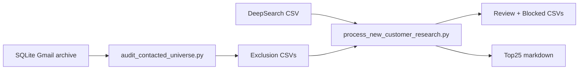

# New-customer prospecting workflow (Phase 10A–10B)

Read-only pipeline to avoid repeating outreach and to prioritize DeepSearch prospects safely.

## Pipeline overview



## Step 1 — Contacted universe (10A / 10A.1)

```bash
cd apps/email-pipeline
export ORIGENLAB_SQLITE_PATH="$HOME/data/origenlab-email/sqlite/emails.sqlite"
uv run python scripts/leads/audit_contacted_universe.py
```

Outputs under `apps/email-pipeline/reports/out/active/current/`:

| File | Use |
|------|-----|
| `contacted_exact_emails_for_exclusion.csv` | Block exact emails already mailed |
| `contacted_domains_for_exclusion.csv` | Block/review domains with Sent history |
| `bounced_emails_for_exclusion.csv` | Never mail again (bounce) |
| `suppressed_contacts_for_exclusion.csv` | Operator suppressions |
| `follow_up_candidates_review.csv` | Human follow-up shortlist |

## Step 2 — DeepSearch input

Place CSV files in:

`reports/in/leads/new_customer_research/`

Expected columns (DeepSearch export):

`organization_name`, `contact_name`, `email`, `domain`, `role_title`, `sector`, `region`, `buyer_type`, `likely_need`, `product_angle`, `evidence_url`, `evidence_note`, `source`, `priority_score`, `confidence`, `recommended_message_angle`, `risk_flags`

Example (local path under `reports/in/`, not committed): `deepsearch_chile_labs_2026-05.csv`

## Step 3 — Process prospects (10B)

```bash
cd apps/email-pipeline
uv run python scripts/leads/process_new_customer_research.py
```

Optional paths:

```bash
uv run python scripts/leads/process_new_customer_research.py \
  --input-dir ../../reports/in/leads/new_customer_research \
  --exclusion-dir reports/out/active/current \
  --out-dir reports/out/active/current
```

### Outputs

| File | Content |
|------|---------|
| `new_customer_targets_review.csv` | Safe / review candidates (not blocked) |
| `new_customer_targets_blocked.csv` | Blocked by no-repeat policy |
| `new_customer_targets_top25.md` | Top picks by segment (Spanish) |
| `new_customer_targets_summary.md` | Counts and classification summary |
| `follow_up_candidates_top25.md` | Top 25 from prior follow-up list |

## Classifications

| Code | Meaning |
|------|---------|
| `net_new_safe_review` | New email/domain — OK for human review |
| `same_domain_contacted_review` | Domain already in Sent history |
| `public_tender_review` | Mercado Público / tender — monitor, no cold mail |
| `research_only_contact_needed` | Strong org, no public email yet |
| `already_contacted_block` | Exact email in Sent/suppression list |
| `bounced_block` | Bounce suppression |
| `suppressed_block` | Manual suppression |
| `supplier_or_internal_block` | Supplier/internal/low_fit |

DeepSearch `risk_flags` are preserved: `dominio_en_historial_origenlab`, `same_organization_review`, `sin_email_publico`, `validar_contacto_publico`, `low_fit`.

## Scoring

- **input_priority_score** — from DeepSearch `priority_score`
- **final_score** — adjusted 0–100 with boosts (equipment fit, named contact, direct email, labs, tenders) and downrank (no email, same-domain, generic inbox, reagents-only)

## Spanish message angles

Auto-selected from product/buyer context:

- Preparación de muestras (homogeneizadores, sonicadores, centrífugas)
- Control de calidad (balanzas, incubadoras)
- Laboratorio ambiental/aguas
- Laboratorio acuícola/salmones
- Apoyo técnico para licitación pública
- Equipamiento para centro de investigación

## Rules (safety)

- No Gmail send or mutation
- No SQLite / Postgres writes
- No outreach state updates
- No secrets or email bodies in outputs
- Human approval required before any campaign send

## Tests

```bash
cd apps/email-pipeline
uv run pytest tests/test_process_new_customer_research.py -q
```

## Related docs

- [`CONTACTED_UNIVERSE_AND_NO_REPEAT.md`](./CONTACTED_UNIVERSE_AND_NO_REPEAT.md)
